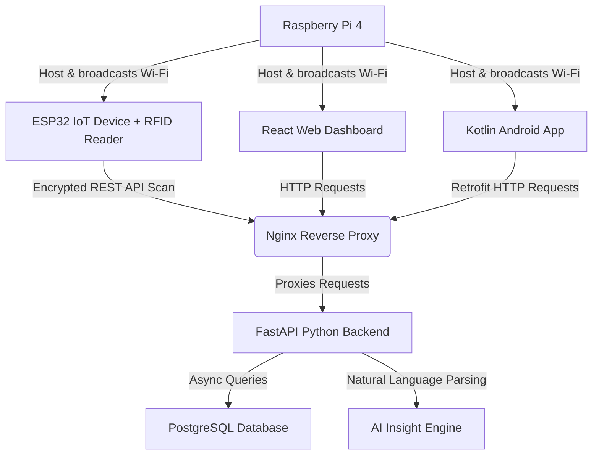

# 🎓 Smart IoT Attendance System — Interview Study Guide
> **Welcome!** This guide is designed to give you a clear, simple, and high-level understanding of the project's architecture, technologies, and features. It prepares you to confidently discuss the project and answer technical questions during an interview.

---

## 🌟 1. System Overview (The "Elevator Pitch")
The **Smart IoT Attendance System** is a standalone, offline-first system designed for university campuses (specifically branded for the **University of Mosul**). 

Instead of relying on slow, expensive cloud services, the entire ecosystem runs locally on a **Raspberry Pi 4**, which acts as a local Wi-Fi router. 
*   **Students** scan physical RFID cards on custom **ESP32** devices.
*   **Instructors and Admins** manage classes, attendance, and grades via a **React Web Dashboard** or a native **Kotlin Android App**.
*   **AI Analytics** are built-in, allowing teachers to ask questions like *"Who is at risk of failing?"* based on their grades and attendance.

---

## 🏗️ 2. High-Level Architecture (How Data Flows)

1. **Scan**: A student taps an RFID card on the ESP32.
2. **Transmit**: The ESP32 sends a POST request with the card's unique ID over the local Wi-Fi.
3. **Route**: **Nginx** on the Raspberry Pi receives the request and forwards it to the **FastAPI** backend.
4. **Process**: FastAPI verifies the student's ID, check if they are enrolled, validates the session, and saves the attendance in the **PostgreSQL** database.
5. **Update**: The **React Web Dashboard** and **Android App** immediately reflect the attendance status in real-time.

---

## 💻 3. The Technology Stack & "Why" We Used It
Interviews love the question: *"Why did you choose this technology over others?"* Here are the simple, powerful answers:

### 🐍 Backend: FastAPI (Python 3.11+)
*   **What it does:** Serves all REST API endpoints, handles authentication, and communicates with the database.
*   **Why we chose it:** 
    *   **Extremely Fast:** It performs on par with Node.js and Go due to its asynchronous (`async/await`) engine.
    *   **Automatic Documentation:** It generates interactive Swagger/OpenAPI docs automatically (accessible at `/docs`), which makes it super easy to integrate with the frontend and mobile apps.
    *   **Type Safety:** Uses Python type hints (via Pydantic) to catch input errors before they crash the server.

### 🐘 Database: PostgreSQL & SQLAlchemy 2.0
*   **What it does:** Stores relational data (Faculties, Departments, Courses, Users, Students, Sessions, and Attendance).
*   **Why we chose it:**
    *   **Relational Model:** Academic structures are inherently hierarchical (Faculty ➔ Department ➔ Course ➔ Session). PostgreSQL manages this cleanly using Foreign Keys and Constraints.
    *   **SQLAlchemy Async ORM:** Allows the Python backend to talk to the database asynchronously, meaning the server doesn't freeze while waiting for database queries to finish.

### ⚛️ Frontend Web: React.js (v18) + TailwindCSS
*   **What it does:** Provides the web dashboard for teachers, department heads, and system administrators.
*   **Why we chose it:**
    *   **Component-Based:** Keeps the code clean, modular, and reusable (e.g., charts, attendance lists, scan buttons).
    *   **TailwindCSS:** Provides modern, ultra-responsive utility-first styling so the dashboard looks beautiful and fits perfectly on both mobile screens and desktops.
    *   **Recharts:** Used to draw beautiful charts and visual trend lines for student attendance and grade metrics.

### 🤖 Mobile App: Native Android (Kotlin + Jetpack Compose)
*   **What it does:** Allows students to view their attendance/grades, and instructors to manage sessions and grades on the go.
*   **Why we chose it:**
    *   **Jetpack Compose:** Modern, declarative UI framework that makes building responsive, animations-rich mobile screens faster and cleaner than XML.
    *   **MVVM (Model-View-ViewModel):** Decouples business logic from UI elements for stable, crash-free code.
    *   **Room DB & DataStore:** Secures offline capability. If there is no network, student data is cached locally via Room, and credentials (JWT token) are saved securely in DataStore.
    *   **Retrofit:** The industry-standard HTTP client for Android to consume backend APIs cleanly.

### 🔌 IoT Hardware: ESP32 + RC522 RFID Reader (C++/PlatformIO)
*   **What it does:** The hardware device mounted at classroom doors to scan RFID student IDs.
*   **Why we chose it:**
    *   **ESP32 Microcontroller:** Very cheap, energy-efficient, and includes built-in Wi-Fi and Bluetooth.
    *   **C++ & Arduino Framework:** Highly optimized, fast hardware access. Programmed using **PlatformIO** (a modern alternative to the basic Arduino IDE).
    *   **Libraries used:**
        *   `MFRC522`: Reads the unique ID from physical RFID cards.
        *   `ArduinoJson`: Converts data to/from JSON to send to the FastAPI server.
        *   `NTPClient`: Syncs accurate time over the network for precise scan logs.

### 📡 Infrastructure: Raspberry Pi 4 (Offline-First Deployment)
*   **What it does:** Hosts the entire system locally inside the school without needing the internet.
*   **Why we chose it:**
    *   **Local Access Point:** Uses `hostapd` and `dnsmasq` to broadcast a local network SSID called `SmartAttendance`.
    *   **Captive Portal & Custom Domain:** Any device connecting to the Wi-Fi is redirected to `otu.university` to load the system.
    *   **PM2 Process Manager:** Automatically starts the FastAPI server and keeps it running 24/7, auto-restarting it if it crashes.
    *   **Nginx Reverse Proxy:** Serves the static React frontend website and routes API requests safely to the FastAPI backend.

---

## 🔒 4. Key Security & Business Logic (Impress the Interviewer!)
Mentioning these points will show that you understand real-world production engineering:

1.  **Duplicate Scan Prevention:** The database enforces a **unique constraint** on `(Student ID, Session ID)`. If a student scans their card twice, the backend rejects it with a `409 Conflict` error to prevent double-marking.
2.  **Role-Based Access Control (RBAC):** Precise 5-tier access control:
    *   *Super Admin / Admin*: Global settings, register devices, and manage faculties.
    *   *Doctor (Professor)*: Manages assessment parameters, defines 40/60 grade weights, and locks final grades.
    *   *Instructor / Engineer*: Registers new ESP32 devices, starts/closes attendance sessions, and drafts quiz scores.
    *   *Student*: Read-only access to their own attendance trend and grades.
3.  **Data Scoping:** A Doctor or Instructor is assigned specific departments. The backend *scopes* queries so they can **only** see students and courses under their direct authority, preventing unauthorized data access.
4.  **Hardware Authentication:** ESP32 devices use a unique `X-Device-Key` header token. The backend rejects any scan requests that do not come from a registered, trusted hardware device.

---

## 💬 5. High-Frequency Interview Questions & Answers
Here are the exact answers to common questions your teammate can use:

### Q1: "How does the system handle offline functionality?"
> **Answer:** "The system is designed to be 100% offline-first. We deploy everything on a Raspberry Pi 4 which acts as a local Wi-Fi router (SSID: `SmartAttendance`). It routes all local traffic to a custom domain `otu.university` via captive portal redirects. If the network drops temporarily, our Kotlin Android app uses a **Room Database** to cache attendance data locally, so users can still see their history without interruption. Once reconnected, the app updates."

### Q2: "What is your API structure, and how do components communicate?"
> **Answer:** "We use RESTful APIs built with FastAPI. All endpoints return JSON payloads. Authentication is handled using stateless JWT (JSON Web Tokens) passed in the `Authorization` header. For the ESP32 hardware devices, we use custom API keys (`X-Device-Key` header) for rapid, low-overhead authentication when uploading RFID card scans."

### Q3: "How do you handle high loads or multiple fast scans at a classroom door?"
> **Answer:** "We implemented three levels of protection:
> 1. At the hardware level, the ESP32 has a built-in cooldown (e.g., 2 seconds) after a successful read to avoid repeated reading of the same card.
> 2. At the database level, we enforce a composite unique constraint on `(student_id, session_id)` to instantly reject duplicates.
> 3. At the backend level, FastAPI handles requests asynchronously (`asyncpg` and `async/await` database queries), meaning it can process hundreds of concurrent card scans without blocking."

### Q4: "Why use FastAPI instead of Django or Flask?"
> **Answer:** "Django is excellent but is very heavy and synchronous by default. Flask is lightweight but requires installing many separate plugins for async support and OpenAPI documentation. FastAPI is fast, modern, natively asynchronous, and generates OpenAPI (Swagger) specs out-of-the-box, saving development time when integrating React and Android."

### Q5: "What is the 40/60 grade distribution feature?"
> **Answer:** "It aligns with local academic standards. Course grades are split into a 40% year-work assessment (quizzes, midterms) and 60% final exam. The system validates that total weight does not exceed 100%, handles weighted math calculations, and lets Doctors finalize gradebooks which locks the records to ensure grading integrity."

---
*Created by Antigravity*
